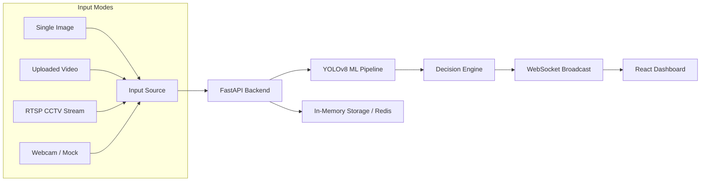

# 🚨 Emergency Intelligence System (EIS)

**Real-time Crowd Anomaly Detection & Intelligence Dashboard**

The Emergency Intelligence System (EIS) is a production-ready, full-stack AI platform designed for large-scale sporting venues and public spaces. It leverages state-of-the-art computer vision to monitor crowd density, detect abnormal movement patterns (such as panic or congestion), and provide actionable intelligence to security personnel in real time.

---

## 🎯 Core Objectives

- **Real-time Monitoring**: Process live CCTV feeds, uploaded videos, or static images.
- **AI-Powered Detection**: Use YOLOv8 to detect people and estimate zone-based crowd density.
- **Anomaly Intelligence**: Automatically identify panic movement, overcrowding, and congestion.
- **Unified Dashboard**: A high-performance React-based command center with live MJPEG streaming and WebSocket alerts.

---

## 🧩 System Architecture



### 1. ML Pipeline (Computer Vision)
- **Object Detection**: YOLOv8n (Nano) optimized for real-time person detection.
- **Zone Grid**: Divides the camera view into a configurable 3x3 grid for localized density analysis.
- **Heatmap Generation**: Computes density percentages per zone to visualize hotspots.

### 2. Decision Engine (Rule-Based AI)
- **Crowding Alerts**: Triggers when zone density exceeds a predefined threshold (e.g., >80%).
- **Panic Detection**: Analyzes frame-to-frame movement vectors to detect sudden, erratic shifts in crowd flow.
- **Automated Actions**: Suggests manual overrides like "Open Gate A" or "Reroute Traffic".

---

## 🚀 Key Features

### 📡 Flexible Input System
- **Image Mode**: Upload and analyze a single frame instantly.
- **Video Analysis**: Process uploaded files frame-by-frame with real-time feedback.
- **Live Stream**: Connect to any RTSP or HTTP camera stream.
- **Webcam Integration**: Direct support for local hardware capture.

### 📊 Intelligence Dashboard
- **Live MJPEG Stream**: Low-latency video feed with YOLOv8 bounding boxes.
- **Dynamic Heatmap**: Interactive grid visualization of crowd distribution.
- **Alert Panel**: Severity-coded notifications (Low, Medium, High) with timestamping.
- **Scenario Simulation**: Test your response protocols with "Panic", "Crowded", or "Normal" demo modes.

---

## 🛠️ Tech Stack

- **Backend**: Python, FastAPI, Uvicorn, OpenCV, Ultralytics (YOLOv8).
- **Frontend**: React.js, Vite, Vanilla CSS (Glassmorphism & Dark Mode).
- **Communication**: WebSockets (Real-time updates), REST (Control APIs).
- **Styling**: Premium custom CSS with dynamic animations and responsive layouts.

---

## 🎯 Chosen Vertical: Public Safety & Emergency Response
The system is tailored for the **Smart City & Large Venue Management** vertical. It addresses the critical need for automated, real-time surveillance in high-density environments like stadiums, transit hubs, and public squares where human monitoring is prone to fatigue and error.

## 🧠 Approach and Logic
The solution follows a **Proactive Surveillance Approach**:
1.  **Spatial Segmentation**: Instead of analyzing the frame as a whole, we divide it into a 3x3 grid to detect localized bottlenecks.
2.  **Temporal Analysis**: We track movement patterns across consecutive frames to distinguish between normal crowd flow and erratic "panic" movements.
3.  **Tiered Alerting**: Alerts are categorized by severity (Low, Medium, High) based on cumulative density and movement anomalies, allowing for prioritized human intervention.

## ⚙️ How the Solution Works
1.  **Ingestion Layer**: Supports diverse inputs (Images, MP4, RTSP, Webcam) using OpenCV.
2.  **Inference Layer**: An optimized YOLOv8n model runs on the FastAPI backend, detecting persons and extracting coordinates.
3.  **Intelligence Layer**: A custom Decision Engine calculates zone-wise density percentages and detects movement vectors.
4.  **Presentation Layer**: A React-based dashboard consumes real-time data via WebSockets, rendering a dynamic heatmap and a live MJPEG stream with bounding box overlays.

## 📝 Any Assumptions Made
-   **Camera Placement**: It is assumed that cameras are mounted at an elevated angle (bird's-eye view) to minimize occlusion and maximize detection accuracy.
-   **Hardware**: The system assumes the host machine has at least a modern multi-core CPU (or NVIDIA GPU) to maintain a minimum of 15-20 FPS for real-time processing.
-   **Network**: For RTSP streams, a stable low-latency network connection is assumed to prevent frame drops in the MJPEG broadcast.

---

## ⚙️ Installation & Setup

### Prerequisites
- Python 3.9+
- Node.js 18+
- Git

### 1. Backend Setup
```bash
cd backend
# Create and activate virtual environment
python -m venv venv
source venv/bin/activate  # On Windows: .\venv\Scripts\activate

# Install dependencies
pip install -r requirements.txt
# Ensure python-multipart is installed for file uploads
pip install python-multipart

### 2. Environment Configuration
Create a `.env` file in the `backend/` directory with the following structure:
```env
# Cloud Database (MongoDB Atlas)
MONGODB_URI=your_mongodb_uri
MONGODB_DB_NAME=eis_db

# Cloud Cache (Upstash Redis)
UPSTASH_REDIS_REST_URL=your_redis_url
UPSTASH_REDIS_REST_TOKEN=your_redis_token

# ML Model
YOLO_MODEL_PATH=yolov8n.pt
YOLO_CONFIDENCE=0.35

# Grid / Zone Configuration
GRID_ROWS=3
GRID_COLS=3

# Alert Thresholds
DENSITY_WARNING=5
DENSITY_CRITICAL=10

# Video
UPLOAD_DIR=uploads
STREAM_FPS=10
```

### 3. Frontend Setup
```bash
cd frontend
# Install dependencies
npm install
```

---

## 🏃 How to Run

### Start the Backend
```bash
cd backend
python -m uvicorn app.main:app --host 0.0.0.0 --port 8000
```
*The API will be available at `http://localhost:8000`. Swagger docs at `/docs`.*

### Start the Frontend
```bash
cd frontend
npm run dev
```
*The dashboard will be available at `http://localhost:5173` (or the next available port).*

---

## 📋 Operational Workflow

1.  **Initialize**: Ensure the backend is running and the YOLO weights are loaded.
2.  **Select Source**: Use the **Input Source** panel to upload a video or connect a live stream.
3.  **Monitor**: Watch the **Live Camera Feed** and **Heatmap Grid** for real-time changes.
4.  **Respond**: When an alert appears in the **Alerts** panel, use the **Command Center** to trigger response actions (Manual Overrides).
5.  **Simulate**: Use the **Simulate Scenario** buttons to train staff or test system connectivity.

---

## 🛡️ License
This project is for demonstration purposes as part of an Advanced Agentic Coding experiment.

---
